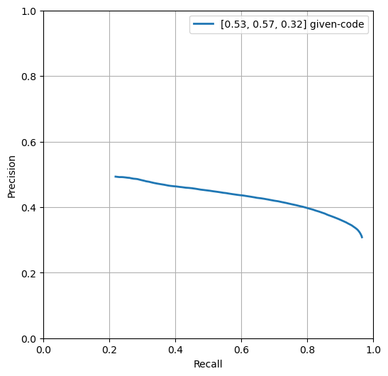
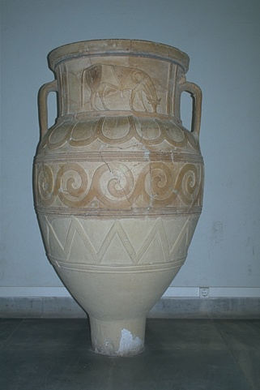

## Contour Detection - Solution Template

**NOTE:** All values and figures in this template are examples that you will need to replace with your own results

1. **Method Description.** *TODO*: Describe the different mehtods and their key implementation detials.

2. **Precision Recall Plot.** *TODO*: Use [contour_plot.py](contours/../contour_plot.py) to add curves for the different methods that you implemented into a single plot.
   
   

      
   

3. **Results Table.** *TODO*: Present the performance metrics for each implementation part in a table format

   | Method | overall max F-score | average max F-score | AP | Runtime (seconds) |
   | ----------- | --- | --- | ---  | --- |
   | Initial implementation | 0.52 | 0.56 | 0.43 | 0.008 |
   | Warm-up [remove boundary artifacts | | | | |
   | Smoothing | | | | |
   | Non-max suppression | | | | 
   | Test set numbers of best model [From gradescope] | | | |

4. **Visualizations.** *TODO:* Include visualization on 3 images (before and after the contour detection). Comment on
   your observations, where does your contour detector work well, where it doesn't and why? you can are also add visualizations of your own images.
   

      
      
   

5. **Bells and Whistles.** *TODO*: Include details of the bells and whistles that you
   tried here.

   *TODO*: Present the performance metrics for the bells and whistles in a table format
   
   | Method | overall max F-score | average max F-score | AP | Runtime (seconds) |
   | ----------- | --- | --- | ---  | --- |
   | Best base Implementation (from above) | | | | 
   | Bells and whistle (1) [extra credit]) | | | | 
   | Bells and whistle (2) [extra credit]) | | | |
   | Bells and whistle (n) [extra credit]) | | | |